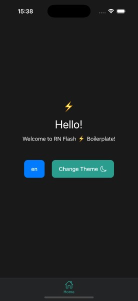

# React Native Flash ⚡ Boilerplate

A fully-featured, modern React Native boilerplate with TypeScript support, navigation structure, multi-language capabilities, theme switching, and more!

## Features

- ⚡ Built with React Native 0.83.0
- ⚛️ React 19.2.0 support
- 🧩 TypeScript for type safety
- 🧭 React Navigation v7 with ready-to-use navigation structure
- 🌗 Dark/Light theme support with ThemeProvider
- 🌐 Internationalization (i18n) with language switching
- 💾 MMKV storage for fast data persistence
- 🔄 State management with Zustand
- 🛡️ Safe Area handling
- 📱 Well-structured project architecture
- 🧹 ESLint and prettier configuration for code quality
- 📏 Consistent metrics system for responsive layouts
- 🎨 Vector Icons integration for beautiful UI elements
- 🧰 Pre-configured UI components ready to use
- 🚀 New Architecture (Fabric & TurboModules) ready

## Project Structure

```
src/
├── assets/           # Fonts, images, and other static files
│   └── fonts/        # Custom fonts
├── components/       # Reusable UI components
│   ├── Button/       # Button component
│   ├── SizedBox/     # Spacing component
│   └── TextField/    # Text input component
├── i18n/             # Internationalization
│   ├── locales/      # Translation files
│   └── initI18next.ts # i18n configuration
├── navigation/       # Navigation setup
│   ├── page-navigators/  # Individual navigators
│   │   ├── HomeStackNavigator.tsx
│   │   ├── AppNavigator.tsx
│   │   └── RootNavigator.tsx
├── screens/          # App screens
│   └── home/         # Home screen
│       ├── index.tsx # Screen component
│       └── styles.ts # Screen styles
├── storage/          # Storage utilities
│   └── index.ts      # MMKV setup
├── store/            # State management
│   └── useStore.ts   # Zustand store
└── theme/            # Theming system
    ├── colors.ts     # Color palette
    ├── metrics.ts    # Consistent sizing
    ├── ThemeProvider.tsx # Theme context
    └── typography.ts # Text styles
```

## Getting Started

### Prerequisites

- Node.js >= 20
- JDK 17 or newer
- Android Studio (for Android development)
- Xcode (for iOS development)
- CocoaPods (for iOS dependencies)
- Ruby (for iOS development)

### Quick Start

**Step 1: Clone the repository**
```bash
git clone https://github.com/phosimurg/rn-flash-boilerplate.git
cd rn_boilerplate
```

**Step 2: Setup and rename your project** ⚡
```bash
yarn setup --project-name "YourAppName" --bundle-name com.yourcompany.yourappname
```

That's it! 🎉 This single command will:
- ✅ Rename your project from "rn_boilerplate" to "YourAppName"
- ✅ Update all bundle identifiers and configurations
- ✅ Install all dependencies
- ✅ Link font assets automatically
- ✅ Configure iOS pods
- ✅ Set up everything for immediate development

**Step 3: Run your app**
```bash
# For iOS
yarn ios

# For Android
yarn android
```

### Alternative Installation Methods

If you prefer to set up manually or rename later:

**Option 1: Setup without renaming first**
```bash
yarn setup
```

**Option 2: Manual installation**
```bash
# Install dependencies
yarn install

# Link font assets
npx react-native-asset

# Install iOS dependencies
cd ios && bundle install && bundle exec pod install && cd ..
```

**Then rename manually when ready:**
```bash
npx react-native-rename "YourAppName" -b com.yourcompany.yourappname
```

### Development Commands

Once your project is set up, you can use these commands:

```bash
# Start Metro bundler
yarn start

# Run on iOS (iPhone 17 Pro simulator by default)
yarn ios

# Run on Android
yarn android

# Install iOS dependencies (if needed later)
cd ios && bundle exec pod install && cd ..

# Link new font assets (if you add fonts later)
npx react-native-asset
```

> **Note:** The iOS command runs on iPhone 17 Pro simulator by default. You can customize this in `package.json`.

## Customization

### Customizing the Simulator

In `package.json`, you can change the iOS simulator by modifying:

```json
"ios": "react-native run-ios --simulator=\"iPhone 17 Pro\" --terminal powershell"
```

Replace "iPhone 17 Pro" with your preferred simulator device.

### Changing Theme Colors

Edit the theme color palette in `src/theme/colors.ts` to match your brand's color scheme.

### Using the Metrics System

The boilerplate includes a powerful metrics system in `src/theme/metrics.ts` that provides consistent spacing, sizing, and responsive values across your app:

```typescript
// Example usage in your styles
import {metrics} from '../theme/metrics';
import typography from "./typography";
import {colors} from "./colors";

const styles = StyleSheet.create({
    container: {
        paddingHorizontal: metrics.scale(10),
        marginBottom: metrics.verticalScale(15),
    },
    title: {
        fontSize: metrics.moderateScale(14),
        fontFamily: typography.BOLD,
        color: colors.primary,
    },
});
```

This ensures your UI looks consistent across different device sizes and orientations.

### Navigation Structure

This boilerplate comes with a fully configured navigation system using React Navigation v7, including:

- Stack Navigator for screen transitions
- Bottom Tab Navigator for main navigation
- Safe Area integrated navigation
- Type-safe navigation with TypeScript

Simply start using the pre-configured navigators or extend them for your specific needs.

### Vector Icons Usage

The project includes React Native Vector Icons, giving you access to thousands of customizable icons:

```typescript
import Icon from 'react-native-vector-icons/MaterialIcons';

// In your component
<Icon name="home" size={metrics.moderateScale(24)} color="#000000" />
```

### Font System

This boilerplate comes with the complete Montserrat font family pre-installed with various weights and styles:

- Manrope-Regular
- Manrope-Bold
- Manrope-ExtraLight
- Manrope-ExtraBold
- Manrope-Medium
- Manrope-Light
- Manrope-SemiBold

The `setup` script (mentioned in the Installation section) automatically links these fonts for both Android and iOS platforms, making them immediately ready to use.

#### Using the built-in fonts:

```typescript
import {typography} from '../theme/typography';
import metrics from "./metrics";

const styles = StyleSheet.create({
    title: {
        fontFamily: typography.BOLD,
        fontSize: metrics.moderateScale(14),
    },
    body: {
        fontFamily: typography.REGULAR,
        fontSize: metrics.moderateScale(12),
    }
});
```

#### Adding Custom Fonts

If you want to use different fonts:

1. Add your font files to `src/assets/fonts/`
2. Run `npx react-native-asset` to link them automatically
3. Update `src/theme/typography.ts` to include your new fonts
4. Run `cd ios && pod install && cd ..` for iOS

### Adding Translation Keys

Add or edit translation keys in the locale files located in `src/i18n/locales/`.

## Troubleshooting

### iOS Build Issues

If you encounter "Could not build module" errors during iOS build, follow these steps:

```bash
# 1. Clean pod cache
cd ios
pod cache clean --all

# 2. Remove Podfile.lock and Pods folder
rm -rf Podfile.lock Pods

# 3. Update pod repo
pod repo update

# 4. Reinstall pods
pod install

# 5. Return to root and clear Metro cache
cd ..
yarn start --reset-cache
```

**In Xcode:**
1. Close Xcode
2. Clean Derived Data: `rm -rf ~/Library/Developer/Xcode/DerivedData/*`
3. Reopen Xcode
4. Product → Clean Build Folder (⇧⌘K)

The Podfile is already configured with proper deployment target settings for React Native 0.83.0.

## Project Setup

### Setup Script

The boilerplate includes a convenient setup script that automates the project initialization process and supports project renaming. To use it, add this script to your package.json:

```json
"scripts": {
  "setup": "node setup.js",
  // other scripts...
}
```

The enhanced `setup.js` file supports command line arguments for project renaming:

```bash
# Setup with project renaming
yarn setup --project-name "YourAppName" --bundle-name com.yourcompany.yourapp

# Setup without renaming
yarn setup
```

The setup script includes:
- Command line argument parsing for project renaming
- Automatic react-native-rename execution
- Dependency installation
- Font asset linking
- iOS pod installation
- Complete project configuration

Also, create a `react-native.config.js` file in your project root:

```javascript
// react-native.config.js
module.exports = {
  project: {
    ios: {},
    android: {},
  },
  assets: ['./src/assets/fonts/'],
};
```

This setup ensures that new users of your boilerplate can get everything running with a single command.

## Dependencies

### Core
- react-native: 0.83.0
- react: 19.2.0

### Navigation
- @react-navigation/native: ^7.1.6
- @react-navigation/stack: ^7.2.10
- @react-navigation/bottom-tabs: ^7.3.10
- @react-navigation/native-stack: ^7.3.10
- react-native-screens: ^4.10.0
- react-native-safe-area-context: ^5.5.2

### State Management
- zustand: ^5.0.3

### Storage
- react-native-mmkv: ^4.1.1

### Internationalization
- i18next: ^25.0.1
- react-i18next: ^15.4.1
- react-native-localize: ^3.4.1

### UI Utilities
- react-native-svg: ^15.11.2
- react-native-vector-icons: ^10.2.0
- react-native-gesture-handler: ^2.25.0

### React Native Core
- @react-native/new-app-screen: 0.83.0
- react-native-nitro-modules: ^0.33.1

### Development Tools
- @react-native-community/cli: 20.0.0
- @react-native-community/cli-platform-android: 20.0.0
- @react-native-community/cli-platform-ios: 20.0.0
- @react-native/babel-preset: 0.83.0
- @react-native/eslint-config: 0.83.0
- @react-native/metro-config: 0.83.0
- @react-native/typescript-config: 0.83.0

### Code Quality
- eslint: ^8.19.0
- prettier: 2.8.8
- typescript: ^5.8.3

## License

This project is licensed under the MIT License - see the LICENSE file for details.

## Author

Created by Ahmet YILDIZ - phosimurg

---

Feel free to contribute, open issues, or suggest improvements!
